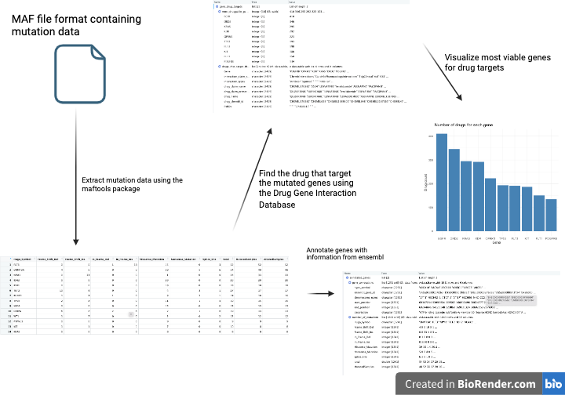

<!-- README.md is generated from README.Rmd. Please edit that file -->

# DrugSeekR

<!-- badges: start -->
<!-- badges: end -->

## Description

`DrugSeekR` is an R package that analyzes genomic data in the format of
MAF files to identify potential drug targets for personalized medicine
through mutational frequency analysis, gene annotation, and drug target
matching. It aims to provide a user-friendly and comprehensive workflow
for finding personalized treatments based on genomic samples from
patients. It leverages existing tools and databases, such as maftools,
biomaRt, and Drug Gene Interaction Database, to perform various steps of
the analysis. The package was developed using
`R version 4.3.1 (2023-06-16)`, Platform: `x86_64-apple-darwin20`
running under `macOS: Monterey 12.6.8`.

## Installation

You can install the development version of DrugSeekR from
[GitHub](https://github.com/) with:

``` r
require("devtools")
devtools::install github("this-wei/DrugSeekR", build vignettes = TRUE)
library("DrugSeekR")
```

To run the shinyApp: Under construction

## Overview

`DrugSeekR` is designed to analyze MAF file inputs. MAF files for
analysis can be found at the repository of the The Cancer Genome Atlas
Program (TCGA), which provides publicly available genomic, epigenomic,
transcriptomic, and proteomic data.

The link is provided here:
(<https://portal.gdc.cancer.gov/repository?filters=%7B%22op%22%3A%22and%22%2C%22content%22%3A%5B%7B%22op%22%3A%22in%22%2C%22content%22%3A%7B%22field%22%3A%22files.access%22%2C%22value%22%3A%5B%22open%22%5D%7D%7D%2C%7B%22op%22%3A%22in%22%2C%22content%22%3A%7B%22field%22%3A%22files.data_format%22%2C%22value%22%3A%5B%22maf%22%5D%7D%7D%5D%7D>)

Note you must unzip and provide the path to the maf.gz file to the
maftools::read.maf function.

``` r
ls("package:DrugSeekR")
browseVignettes("DrugSeekR")
```

`DrugSeekR` contains 4 functions: 1. ***calculateMutationFrequency***
for calculating the frequency and percentage of observed mutations
within a sample. 2. ***annotateGenes*** for annotating the genes with
information from the ensembl database and returns the top genes with the
highest number of mutations. Note this function must use dbplyr version
2.3.4 due to a known bug 3. ***getGeneDrugTargets*** for finding the
most druggable genes and the drugs that target them from the Drug Gene
Interaction Database. 4. ***plotDruggableGenes*** for ploting the number
of drugs for each gene using ggplot2.



## Contributions

The author of the package is Wei Jin Luo. The author wrote the
calculate_mutation_frequency function, which calculates the frequency
and percentage of observed mutations within a sample. The
calculate_mutation_frequency function makes use of the maftools R
package to get a summary of mutation data.

The author wrote the annotate_genes function, which annotates the genes
with information from the ensembl database and returns the top genes
with the highest number of mutations. The functions make use of the
biomaRt R package to query the ensembl database.

The author wrote the get_gene_drug_targets function, which finds the
most druggable genes and the drugs that target them from the Drug Gene
Interaction Database. The functions makes use of the maftools R package
to query the Drug Gene Interaction Database.

The author wrote the plot_druggable_genes function, which plots the
number of drugs for each gene. The plot_druggable_genes function makes
use of the ggplot2 R package to create the plot.

## References

- Mayakonda A, Lin DC, Assenov Y, Plass C, Koeffler HP (2018). Maftools:
  efficient and comprehensive analysis of somatic variants in cancer.
  *Genome Research*. <http://dx.doi.org/10.1101/gr.239244.118>

- Cancer Genome Atlas Research, N. Genomic and epigenomic landscapes of
  adult de novo acute myeloid leukemia. *N Engl J Med 368*, 2059-74.
  2013

- Steffen Durinck, Paul T. Spellman, Ewan Birney and Wolfgang Huber
  (2009). Mapping identifiers for the integration of genomic datasets
  with the R/Bioconductor package biomaRt. *Nature Protocols 4*,
  1184-1191 .

- Steffen Durinck, Yves Moreau, Arek Kasprzyk, Sean Davis, Bart De Moor,
  Alvis Brazma and Wolfgang Huber (2005). BioMart and Bioconductor: a
  powerful link between biological databases and microarray data
  analysis. *Bioinformatics 21*, 3439-3440

- Griffith, M., Griffith, O., Coffman, A. et al (2013). DGIdb: mining
  the druggable genome. *Nat Methods 10*, 1209–1210.
  <https://doi.org/10.1038/nmeth.2689>

- H. Wickham (2016). ggplot2: Elegant Graphics for Data Analysis.
  *Springer-Verlag New York*

## Acknowledgements

This package was developed as part of an assessment for 2022 BCB410H:
Applied Bioinformatics course at the University of Toronto, Toronto,
CANADA. DrugSeekR welcomes issues, enhancement requests, and other
contributions. To submit an issue, use the GitHub issues.
